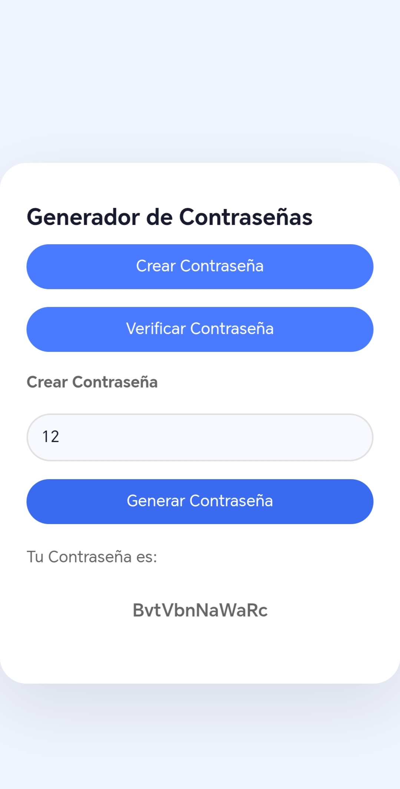
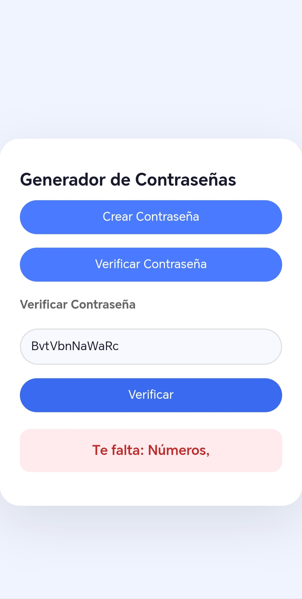

Aplicación web para generar y verificar contraseñas seguras
Genera contraseñas aleatorias con la longitud que elijas
Verifica si tu contraseña es segura y te dice qué mejorar

Screenshots

Hecho con: Python, Flask, Html, CSS, Javascript
para la creacion del Frontend me apoye de IA debido a que no es mi punto fuerte pero busco mejorar en el.

Desarrollado por: Eduardo Bojórquez- Estudiante de preparatoria
